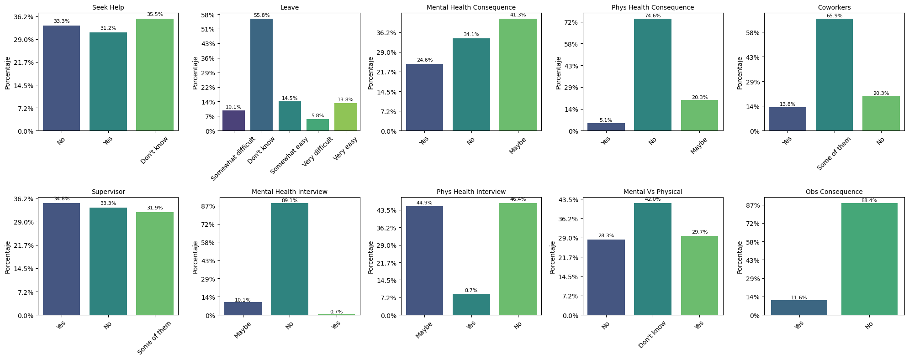
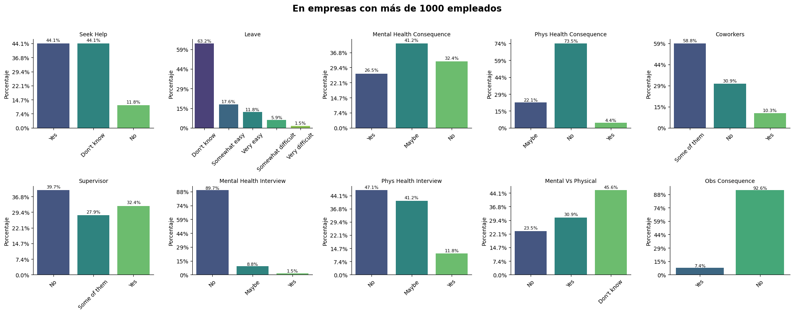

# Acerca de este archivo

Este conjunto de datos contiene respuestas de la encuesta sobre salud mental en la industria tecnológica realizada en 2014. Cada columna representa un punto de datos específico recopilado de personas que trabajan en el sector tecnológico. La información ofrece una visión sobre aspectos demográficos, el entorno laboral y experiencias relacionadas con la salud mental, incluyendo el tratamiento y su impacto en el trabajo.

## Descripciones de los campos

### Timestamp (Marca de tiempo)
**Descripción:**  
Fecha y hora exacta en que se envió la respuesta a la encuesta. Es útil para entender la distribución temporal de las respuestas y hacer un seguimiento del período de recolección de datos.

### Age (Edad)
**Descripción:**  
Edad del/de la encuestado/a en años. Permite realizar análisis sobre tendencias y actitudes relacionadas con la salud mental según diferentes grupos etarios.

### Gender (Género)
**Descripción:**  
Identidad de género autoidentificada del/de la encuestado/a (por ejemplo, Hombre, Mujer, No binario, etc.). Útil para analizar diferencias en las experiencias de salud mental según la identidad de género.

### Country (País)
**Descripción:**  
País de residencia del/de la encuestado/a. Permite realizar comparaciones geográficas y análisis por regiones.

### state (Estado)
**Descripción:**  
Para encuestados/as en Estados Unidos, este campo indica el estado o territorio de residencia. Para personas de otros países, puede estar en blanco o indicar que no aplica. Es útil para comparaciones regionales dentro de EE. UU.

### self_employed (Trabajo independiente)
**Descripción:**  
Indica si el/la encuestado/a trabaja por cuenta propia. Esta variable binaria (o categórica) ayuda a diferenciar entre personas autoempleadas y aquellas que trabajan para una organización, lo que puede influir en el acceso al apoyo laboral y en la dinámica de salud mental.

### family_history (Antecedentes familiares)
**Descripción:**  
Señala si el/la encuestado/a tiene antecedentes familiares de enfermedades mentales. Es importante para explorar posibles predisposiciones genéticas o ambientales que puedan influir en su salud mental.

### treatment (Tratamiento)
**Descripción:**  
Indica si el/la encuestado/a ha buscado tratamiento para una condición de salud mental. Este campo ofrece información sobre el uso de servicios de salud mental y puede ser un indicador de la gravedad o el reconocimiento de problemas de salud mental en profesionales del sector tecnológico.

### work_interfere (Interferencia en el trabajo)
**Descripción:**  
Evalúa en qué medida la condición de salud mental del/de la encuestado/a interfiere con su trabajo. Las respuestas (por ejemplo, nunca, rara vez, a veces, frecuentemente) permiten medir el impacto de la salud mental en el rendimiento y la productividad laboral.

### no_employees (Número de empleados)
**Descripción:**  
Tamaño de la empresa u organización donde trabaja el/la encuestado/a. Este campo suele presentarse en rangos categóricos (por ejemplo, 1-5, 6-25, 26-100, etc.) y permite estudiar cómo el tamaño de la empresa se relaciona con la disponibilidad de recursos de salud mental y la cultura laboral.

### remote_work (Trabajo remoto)
**Descripción:**  
¿Trabajas de forma remota (fuera de una oficina) al menos el 50% del tiempo?

### tech_company (Empresa tecnológica)
**Descripción:**  
¿Tu empleador es principalmente una empresa u organización tecnológica?

### benefits (Beneficios)
**Descripción:**  
¿Tu empleador ofrece beneficios relacionados con la salud mental?

### care_options (Opciones de atención)
**Descripción:**  
¿Conoces las opciones de atención en salud mental que ofrece tu empleador?

### wellness_program (Programa de bienestar)
**Descripción:**  
¿Tu empleador ha hablado alguna vez sobre salud mental como parte de un programa de bienestar para empleados?

### seek_help (Buscar ayuda)
**Descripción:**  
¿Tu empleador proporciona recursos para aprender sobre salud mental y cómo buscar ayuda?

### anonymity (Anonimato)
**Descripción:**  
¿Tu anonimato está protegido si decides hacer uso de los recursos para tratamiento de salud mental o abuso de sustancias?

### leave (Baja médica)
**Descripción:**  
¿Qué tan fácil es para ti tomar una baja médica por una condición de salud mental?

### mental_health_consequence (Consecuencias por salud mental)
**Descripción:**  
¿Crees que hablar sobre un problema de salud mental con tu empleador tendría consecuencias negativas?

### phys_health_consequence (Consecuencias por salud física)
**Descripción:**  
¿Crees que hablar sobre un problema de salud física con tu empleador tendría consecuencias negativas?

### coworkers (Compañeros de trabajo)
**Descripción:**  
¿Estarías dispuesto/a a hablar sobre un problema de salud mental con tus compañeros/as de trabajo?

### supervisor (Supervisores)
**Descripción:**  
¿Estarías dispuesto/a a hablar sobre un problema de salud mental con tus supervisores directos?

### mental_health_interview (Entrevista - salud mental)
**Descripción:**  
¿Mencionarías un problema de salud mental en una entrevista con un posible empleador?

### phys_health_interview (Entrevista - salud física)
**Descripción:**  
¿Mencionarías un problema de salud física en una entrevista con un posible empleador?

### mental_vs_physical (Salud mental vs física)
**Descripción:**  
¿Sientes que tu empleador toma la salud mental tan en serio como la salud física?

### obs_consequence (Consecuencias observadas)
**Descripción:**  
¿Has escuchado o presenciado consecuencias negativas para compañeros/as con condiciones de salud mental en tu lugar de trabajo?

### comments (Comentarios)
**Descripción:**  
Notas o comentarios adicionales.

## Registro de comentarios de la encuesta

- *Relativamente nuevo en el trabajo. Pregunta más adelante.*

- *En startups pequeñas, es muy difícil mantener los problemas de salud mental verdaderamente en privado, sin importar lo que haga la gerencia.*

- *No lo sé porque no lo he comprobado, no porque sea difícil averiguarlo. Si no hubieras dado la opción "no lo sé", habría buscado la respuesta.*

- *Independientemente de que se diga que no hay consecuencias negativas por hablar de temas de salud mental con compañeros o superiores, el sesgo inconsciente es algo muy real. Mientras no *necesite* informar a mis compañeros, mis problemas de salud mental no tienen por qué ser de conocimiento público.*

- *Me preocupa cómo nuestro proceso de contratación tiende a filtrar a personas neurodivergentes de todo tipo. Personas competentes que actúan un poco diferente pueden ser difíciles de contratar.*

- *Hablé una vez con un psiquiatra sobre tomar una baja médica por temas de salud mental con su referencia. Estaba dispuesto a ayudar, pero me advirtió que podría no convenirme, ya que ha visto cómo ese tipo de cosas persiguen a las personas durante su carrera en tecnología (la gente se entera, incluso si es confidencial en el trabajo). Desde entonces, me da pánico mencionar la salud mental en cualquier lugar donde puedan verlo compañeros o posibles empleadores.*

- *Ahora en una startup. Antes trabajaba en una gran empresa tecnológica que era bastante buena en apoyar temas de salud mental. Aun así, no compartiría nada con jefes u otros empleados porque sigue existiendo un estigma muy fuerte.*

- *Actualmente tengo a los mejores gerentes con los que he trabajado. No tengo problemas, pero uno de mis compañeros sí, y fue manejado de forma excelente.*

- *No conozco a nadie con problemas de salud mental en el trabajo, definitivamente no es algo que se discuta en público. También hay mucha otra información personal que no conozco sobre mis compañeros, así que puede ser simplemente que tendemos a no hablar de temas personales.*

- *Problema de salud mental que he enfrentado: depresión aguda.*

- *Gracias por lo que están haciendo. Solo un dato: estas preguntas no aplican del todo a emprendedores, donde el empleador = cofundadores / dirección / yo mismo.*

- *Como soy el CEO de mi startup, algunas preguntas como “¿te sentirías cómodo?” o “¿conoces la política?” son curiosas. ¡Claro que me siento cómodo, nadie puede despedirme, y conozco las políticas porque yo las establecí! Sin embargo, ahora me pregunto si mis empleados saben lo comprometida que está la empresa con la salud mental, y esta encuesta me está haciendo dar cuenta de que probablemente no lo hemos comunicado bien. Gracias por hacer esto.*

- *Puede que sea seguro hablar del tema donde estoy ahora, pero no lo sé con certeza y prefiero pecar de precavido. Lucho con depresión y ansiedad, lo que a veces afecta mi productividad, pero trato de compensarlo o disimularlo en lugar de ser abierto al respecto.*

- *Ninguno de los que ya estamos en grupos marginados en tecnología —los no jóvenes, los no hombres, los no blancos— arriesgaremos nuestras carreras admitiendo otra fuente de estigma: la mala salud.*

- *La principal razón de mis respuestas sobre apertura se debe a una experiencia con mi anterior empleador. Sentí que podía confiar en mi supervisor directo, así que le conté. La información se filtró a más supervisores y eventualmente a mis compañeros. Los superiores recomendaron fuertemente tratamiento, pero apresuraron procesos que no debían apresurarse, y terminé siendo tratado incorrectamente en una sala psiquiátrica. La experiencia me dejó secuelas mentales. Perdí gran parte de mi motivación para programar y también miles de dólares en tiempo perdido, vacaciones que usaron para tratamiento, gastos médicos, etc. Tengo trastorno depresivo mayor, alta ansiedad y agorafobia leve. Después de ver lo que el tratamiento me ofreció, probablemente no lo busque de nuevo y continúe como estoy. (En resumen.)*

- *Trastorno bipolar.*

### 📊 Datos clave en EE. UU.

- **76% de los trabajadores estadounidenses** reportaron al menos un síntoma de una condición de salud mental.[HHS.gov](https://www.hhs.gov/es/surgeongeneral/reports-and-publications/workplace-well-being/index.html?utm_source=chatgpt.com)
- **84% de los encuestados** indicaron que las condiciones de su lugar de trabajo contribuyeron a al menos un problema de salud mental.[HHS.gov](https://www.hhs.gov/es/surgeongeneral/reports-and-publications/workplace-well-being/index.html?utm_source=chatgpt.com)
- **81% de los trabajadores** manifestaron que buscarán lugares de trabajo que respalden la salud mental en el futuro.[HHS.gov](https://www.hhs.gov/es/surgeongeneral/reports-and-publications/workplace-well-being/index.html?utm_source=chatgpt.com)

Estos datos provienen del Informe sobre Salud Mental en el Trabajo 2021 de Mind Share Partners y de la Encuesta de Trabajo y Bienestar de la APA de 2022 .[HHS.gov+1Business Insider España+1](https://www.hhs.gov/es/surgeongeneral/reports-and-publications/workplace-well-being/index.html?utm_source=chatgpt.com)

---

### 📍 Enfoque en California

- **California** ha aprobado legislación que establece estándares voluntarios para la salud mental en el lugar de trabajo. Esta medida busca equiparar la estrategia de salud mental en el trabajo con la atención que se brinda a la salud física, permitiendo que los empleados se sientan cómodos al tomar licencias médicas por problemas de salud mental .[KFF Health News+1Labor Law PC+1](https://kffhealthnews.org/news/empleadores-buscan-nuevas-formas-de-abordar-la-salud-mental-de-los-trabajadores/?utm_source=chatgpt.com)
- **Leyes laborales de California** exigen a las empresas tratar los problemas de salud mental con la misma seriedad que las discapacidades físicas. Los empleados tienen derecho a ajustes razonables, como horarios de trabajo flexibles, opciones de trabajo a distancia y ajustes en la carga de trabajo .[Labor Law PC](https://www.laborlawpc.com/es/blog/california-labor-laws-supporting-mental-health-in-the-workplace/?utm_source=chatgpt.com)

---

### 🧠 Impacto en el sector tecnológico de Silicon Valley

- En Silicon Valley, **el 81% de los trabajadores de la Generación Z** ha dejado un trabajo por razones de salud mental.[Business Insider España](https://www.businessinsider.es/tecnologia/hay-crisis-salud-mental-silicon-valley-1043297?utm_source=chatgpt.com)
- **El 38% de las mujeres en tecnología** han considerado dejar la industria debido al agotamiento, el sexismo institucionalizado y la cultura tóxica .[Business Insider España](https://www.businessinsider.es/tecnologia/hay-crisis-salud-mental-silicon-valley-1043297?utm_source=chatgpt.com)

